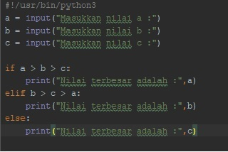

# Latihan1
Diketahui 3 buah bilangan a,b,c, akan dicari nilai yang terbesar.

Struktur Indonesia

 1. Mulai
 2. Inisiasi a,b,c sebagai integer.
 3. Baca a.
 4. Baca b.
 5. Baca c.
 6. Jika a > b dan a > c maka kerjakan langkah 8, selain itu
 7. Jika b > a dan b > c maka kerjakan langkah 9, selain itu kerjakan langkah 10.
 8. Cetak “Bilangan Terbesar Bilangan Pertama”.
 9. Cetak “Bilangan Terbesar Bilangan Kedua”.
 10. Cetak “Bilangan Terbesar Bilangan Ketiga”.
 11. Selesai

		